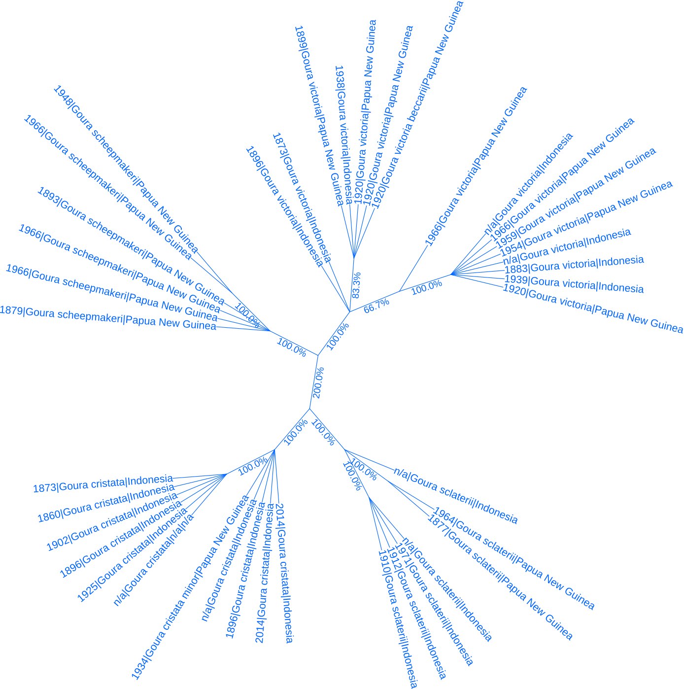
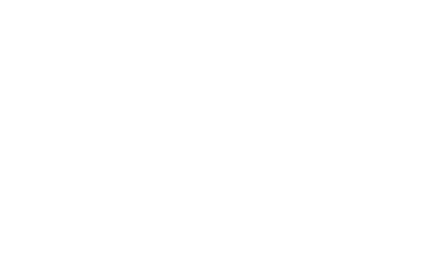

# Tracing Goura Haplotypes Through Time

## Consensus Tree of Goura Specimens from Cytochrome B

Before making haplotype delineations in R, we created a maximum parsimony consensus tree of the 40 *Goura* specimen based on their CYTB genes. This way population structure is inferred phylogenetically by observing which specimen are more closely related.

1. **Extraction of cytochrome b DNA sequences:**
    Cytochrome b DNA sequences were written to the FASTA file '__cytochrome_b.fasta__' with the python executable '__concatenate_genes.py__' using the terms 'CYTB' and 'cob' for input genes as the gene is annotated by either name in the genbank files:
    ~~~bash
    output_file="data/raw/genera/Goura/genes/cytb.fasta"
    > $output_file

    for file in data/raw/*.gb; do
        echo ">$(basename ${file%.gb})" >> $output_file
        python3 src/preprocessing/concatenate_genes.py --genes CYTB cob --input $file >> data/raw/genes_all/cytb.fasta
    done 
    ~~~

    The resulting FASTA file was manually assesed, and it was confirmed that each entry corresponded to the intended gene. 
    
2. **Trimming of sequence ends:**
    The sequences varied in length by 2 terminal bp, and were trimmed from the terminal end down to the length of the shortest sequence in the FASTA file with the script '__trim_length.py__' using the following command:

    ~~~bash
    python3 src/preprocessing/trim_length.py --input data/raw/genera/Goura/genes/cytb.fasta --output data/processed/genera/Goura/trimmed_fasta/cytb.fasta
    ~~~

3. **Renaming the CYTB sequences to reflect sample origin:**
    To enhance the interpretability of our data, the sequences in '__cytb.fasta__' were systematically renamed. This renaming process labels each sequence with details about the specimen collection year, species, geographical origin, and the collector. This procedure is crucial for downstream analyses where such contextual information is needed.
    
    **Procedure:**
    1. **Prepare the mapping table:** Ensure that the '__sample_origins.csv__' file is formatted correctly, with the key (the accession number) in the first column.
    2. **Run the renaming script:** Use the '__rename_fasta.py__' script to update the sequence names. The script takes the mapping table, the input FASTA, and the headers of the columns to be used for the new names as inputs. The output was passed to a new file, '__data/processed/genera/Goura/renamed_fasta/cytb.fasta__'.

    **Command:**

    ~~~bash
    python3 src/preprocessing/rename_fasta.py data/metadata/sample_origins.csv data/processed/genera/Goura/trimmed_fasta/cytb.fasta COLLECTION_DATE ORGANISM COUNTRY COLLECTED_BY > data/processed/genera/Goura/renamed_fasta/cytb.fasta
    ~~~

4. **Maximum parsimony consensus tree using PAUP:**
    <!--Include how the sequence names were shortened to work in NEXUS format-->
    - **Sequence alignment using MAFFT:**
    The CYTB sequences were aligned with MAFFT by executing the following command:

    ~~~bash
    mafft --auto data/processed/genera/Goura/renamed_fasta/cytb.fasta > data/processed/genera/Goura/cytb.aligned.fasta
    ~~~

    The alignment was visually inspected with Jalview v. 2.11.2.7 and AliView v.2021.

    - **Conversion of the alignment to NEXUS format:**
    The alignment was converted to NEXUS format with seqconverter by executing the following command:
    
    ~~~bash
    seqconverter -I fasta -O nexus data/processed/genera/Goura/cytb.aligned.fasta > data/processed/genera/Goura/cytb.nexus
    ~~~

    - **Consensus tree with branch support values:**
    We searched for equally parsimonious unrooted trees in PAUP using a heuristic search (hsearch) with optimality criterion set to 'parsimony'. The root method was set to 'midpoint'. We set 'increase=auto' to allow PAUP to store an unlimited number of trees, used the branch-swapping algorithm 'tree-bisection-reconnection' (TBR) as described in 'Week 5: Consensus trees' of course 22115 by Anders Gorm Pedersen at DTU Health Tech [^1]:

    ~~~bash
    paup> execute data/processed/genera/Goura/cytb.nexus
    paup> set root=midpoint
    paup> set increase=auto
    paup> hsearch start=stepwise addseq=random nreps=20 rseed=98367 swap=TBR
    ~~~

    From this search, 12 equally parsimonious trees were found. These trees were summarized in a consensus tree according to the majority rule, i.e. monophyletic groups occuring in at least 50% of the 12 equally parsimonious trees are accepted. The consesus tree, with branches labeled with support values i.e. the frequency with which the more terminal branches were monophyletic, was generated and saved by executing the following command:
    
    ~~~bash
    paup> contree all /strict=no majrule=yes percent=50 treefile=data/processed/genera/Goura/cytb.consensus.tree.nexus
    ~~~

    The 12 equaly parsimonious trees were saved as well:

    ~~~bash
    paup> savetrees file=data/processed/genera/Goura/cytb.parsimonious_trees.nexus
    ~~~

5. **Annotation of consensus tree:**

    - **Support value discrepancy:**
    Before annotating the consensus tree we noticed a discrepancy in a support value between the direct PAUP output printed to the screen and the NEXUS file of the consensus tree saved directly from the PAUP output. Specifically the NEXUS file contained a basal support value of 200%, while the PAUP output printed to the screen showed the same branch with a support value of 100%. We noted that none of the support values printed in PAUP exceeded 100%. We then compared the support values of the consensus tree printed in PAUP with the NEXUS formatted tree visualized in iToL and confirmed that all support values matched except for the basal 200% value. We attribute this discrepancy to a bug in the conversion process from PAUP to a tree file, possibly associated with our choice to produce an unrooted tree and not include an outgroup. We imagined that we manually corrected the basal 200% support value to 100% in iTol.

    - **Annotation of leaf nodes in iTol:**
    To create an annotation file, we first created a column of new names by joining the columns 'COLLECTION_DATE', 'ORGANISM', 'COUNTRY', and 'COLLECTED_BY' of the metadata file 'data/metadata/__sample_origins.csv__' by '|' using Excel. For the 40 Goura specimens, this new column was copied together with the 'ACCESSION' to the bottom of a copy of the iToL annotation template 'docs/templates/__annotation_template.txt__', the 'SEPARATOR' set to 'TAB', and saved as 'data/metadata/__goura_annotations.txt__'. The resulting tree is saved as 'results/figures/__goura.cytb.tree.png__'. We also made a tree labeled with only collection date, organism, and country of origin, as shown below:

### Interpretation of Goura CYTB Consensus Tree 

We first of all observed that all specimen delineate according to species, and that *G. cristata* and *G. sclaterii* constitute one monophyletic group while *G. victoria* and *G. scheepmakeri* constitute another in agreement with the species trees in [species_tree.md](../../docs/notes/species_tree.md), and that all specimen appear to have been correctly assigned to species showing that Cytochrome B provides high enough resolution to correctly represent the phylogenetic organization of species within the Goura genus. There was some uncertainty to whether *Goura cristata minor*, collected in 1934, had been correctly species determined, as it is labeled as Papua New Guinean as opposed to the other *G. cristata*, which are from western New Guinea in Indonesia. *G. sclaterii* delineates into two clades: One collected in Indonesia and one collected in Papua New Guinea - both clades have a support value of 100%. We also noted that for *G. cristata* there exists a clade from which no samples have been collected since 1925 - except for one specimen without specified sampling year or place - including the specimen collected in 1860 by Charles M. Allen. For *G. victoria* there is a clade, containing the only specimen of subspecies baccarii, that has no samples younger than from 1938.

## Maximum Likelihood Tree of Orthologous Mitogenes

To create phylogenetic trees based on all core orthologous genes of the mitogenomes, we decided to use OrthoFinder v. 2.5.5.  For this we first extracted protein sequences of all coding sequences of the *Goura* genomes and of the reference genomes. We used the script [__extract_proteins.py__](../../src/preprocessing/extract_proteins.py), which takes a directory of Genbank files and an output directory as inputs, to produce protein sequence FASTA-files for each *Goura* species by executing the following command:

~~~bash
python3 extract_proteins.py data/raw/genera/Goura/ data/raw/genera/Goura/fasta/
~~~

We then made the extract_proteins.py script executable as a command-line tool by adding the line '__#!/usr/bin/env python3__' to it, granting it execute permission by running '__chmod +x src/preprocessing/extract_proteins.py__' and adding '__scr/preprocessing/__' to PATH in our .bashrc file.

We then, executed the following command, to extract all protein coding sequences from the reference genomes:

~~~bash
extract_proteins.py data/raw/reference_genomes data/raw/reference_genomes/fasta/
~~~

We used the program OrthoFinder v. 2.5.5 to find gene orthologs and gene duplication events among the mitogenomes of either the *Goura* specimens or the reference genomes - including the four of *Goura* species. We first ran OrthoFinder on the reference genomes, passing OrthoFinder the nine-species maximum parsimony mitogenome tree rooted on Ectopistes migratorius '__data/processed/mitochondria.tree.for_orthofinder.newick__', with '.1' added to the genome names to match them with the protein sequence file names, as well as the path to the directory with protein sequences of those species '__data/raw/reference_genomes/fasta/__':

~~~bash
orthofinder -s data/processed/mitochondria_tree.for_orthofinder.newick -f data/raw/reference_genomes/fasta/
~~~

The OrthoFinder results revealed that no gene duplications had occured in the mitochondrial genomes of our nine species since their most recent common ancestor (MRCA). As illustrated by the species tree below, where the number after the underscore, '_', of each node label (N0,N1..) represents the number of duplications on the branch leading to that node. The number of duplications are zero along all branches.

We then ran OrthoFinder on the 40 Goura genomes and found that all 13 mitogenes were single copy ortholouges across all four species. The results are in '__data/raw/genera/Goura/fasta__'.

## Cytochrome B Haplotypes Across Time

See src/analysis/cytochrome_B_haplotypes.R

[^1]:[Consus Trees, Week 5, 22115 - Computational Molecular Evolution](https://teaching.healthtech.dtu.dk/22115/index.php/Consensus_Trees)

