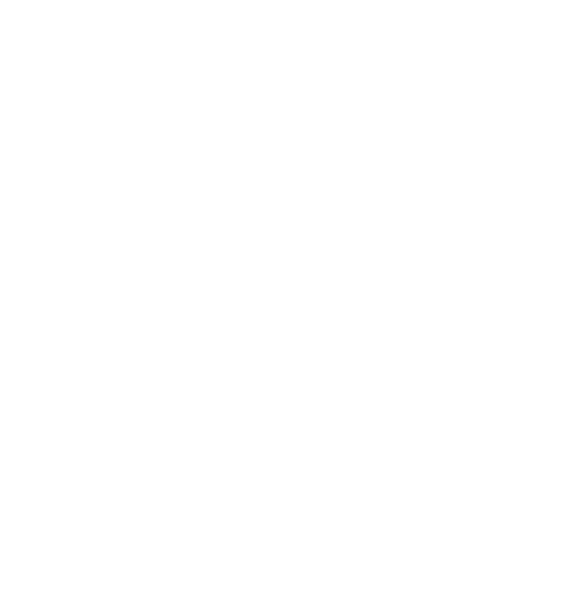

# Tracing Goura Haplotypes Through Time

## Consensus Tree of Goura Specimens with Cytochrome B

1. **Extraction of cytochrome b DNA sequences:**
    Cytochrome b DNA sequences were written to the FASTA file '__cytochrome_b.fasta__' with the python executable '__concatenate_genes.py__' using the terms 'CYTB' and 'cob' for input genes as the gene is annotated by either name in the genbank files:
    ~~~bash
    output_file="data/raw/genera/Goura/genes/cytb.fasta"
    > $output_file

    for file in data/raw/*.gb; do
        echo ">$(basename ${file%.gb})" >> $output_file
        python3 src/preprocessing/concatenate_genes.py --genes CYTB cob --input $file >> data/raw/genes_all/cytb.fasta
    done 
    ~~~

    The resulting FASTA file was manually assesed, and it was confirmed that each entry corresponded to the intended gene. 
    
2. **Trimming of sequence ends:**
    The sequences varied in length by 2 terminal bp, and were trimmed from the terminal end down to the length of the shortest sequence in the FASTA file with the script '__trim_length.py__' using the following command:

    ~~~bash
    python3 src/preprocessing/trim_length.py --input data/raw/genera/Goura/genes/cytb.fasta --output data/processed/genera/Goura/trimmed_fasta/cytb.fasta
    ~~~

3. **Renaming the CYTB sequences to reflect sample origin:**
    To enhance the interpretability of our data, the sequences in '__cytb.fasta__' were systematically renamed. This renaming process labels each sequence with details about the specimen collection year, species, geographical origin, and the collector. This procedure is crucial for downstream analyses where such contextual information is needed.
    
    **Procedure:**
    1. **Prepare the mapping table:** Ensure that the '__sample_origins.csv__' file is formatted correctly, with the key (typically the accession number) in the first column.
    2. **Run the renaming script:** Use the '__rename_fasta.py__' script to update the sequence names. The script takes inputs specifying the paths to the mapping table and input FASTA, and the headers of the columns to be used for the new names. The output was passed to a new file, '__data/processed/genera/Goura/renamed_fasta/cytb.fasta__'.

    **Command:**

    ~~~bash
    python3 src/preprocessing/rename_fasta.py data/metadata/sample_origins.csv data/processed/genera/Goura/trimmed_fasta/cytb.fasta COLLECTION_DATE ORGANISM COUNTRY COLLECTED_BY > data/processed/genera/Goura/renamed_fasta/cytb.fasta
    ~~~

4. **Maximum parsimony consensus tree using PAUP:**
    As the renamed sequence names were too long for downstream analysis with PAUP, the following steps were done with the accession nr.-named sequences.
    - **Sequence alignment using MAFFT:**
    The CYTB sequences were aligned with MAFFT by executing the following command:

    ~~~bash
    mafft --auto data/processed/genera/Goura/renamed_fasta/cytb.fasta > data/processed/genera/Goura/cytb.aligned.fasta
    ~~~

    The alignment was visually inspected with Jalview v. 2.11.2.7 and AliView v.2021.

    - **Conversion of the alignment to NEXUS format:**
    The alignment was converted to NEXUS format with seqconverter by executing the following command:
    
    ~~~bash
    seqconverter -I fasta -O nexus data/processed/genera/Goura/cytb.aligned.fasta > data/processed/genera/Goura/cytb.nexus
    ~~~

    - **Consensus tree with branch support values:**
    We searched for equally parsimonious unrooted trees in PAUP using a heuristic search (hsearch) with optimality criterion set to 'parsimony'. The root method was set to 'midpoint'. We set 'increase=auto' to allow PAUP to store an unlimited number of trees, used the branch-swapping algorithm 'tree-bisection-reconnection' (TBR) as described in 'Week 5: Consensus trees' of course 22115 by Anders Gorm Pedersen at DTU Health Tech [^1]:

    ~~~bash
    paup> execute data/processed/genera/Goura/cytb.nexus
    paup> set root=midpoint
    paup> set increase=auto
    paup> hsearch start=stepwise addseq=random nreps=20 rseed=98367 swap=TBR
    ~~~

    From this search, 12 equally parsimonious trees were found. These trees were summarized in a consensus tree according to the majority rule, i.e. monophyletic groups occuring in at least 50% of the 12 equally parsimonious trees are accepted. The consesus tree, with branches labeled with support values i.e. the frequency with which the more terminal branches were monophyletic, was generated and saved by executing the following command:
    
    ~~~bash
    paup> contree all /strict=no majrule=yes percent=50 treefile=data/processed/genera/Goura/cytb.consensus.tree.nexus
    ~~~

    The 12 equaly parsimonious trees were saved as well:

    ~~~bash
    paup> savetrees file=data/processed/genera/Goura/cytb.parsimonious_trees.nexus
    ~~~

5. **Annotation of consensus tree:**

    - **Support value discrepancy:**
    Before annotating the consensus tree we noticed a discrepancy in a support value between the direct PAUP output printed to the screen and the NEXUS file of the consensus tree saved directly from the PAUP output. Specifically the NEXUS file contained a basal support value of 200%, while the PAUP output printed to the screen showed the same branch with a support value of 100%. We noted that none of the support values printed in PAUP exceeded 100%. We then compared the support values of the consensus tree printed in PAUP with the NEXUS formatted tree visualized in iToL and confirmed that all support values matched except for the basal 200% value. We attribute this discrepancy to a bug in the conversion process from PAUP to a tree file, possibly associated with our choice to produce an unrooted tree and not include an outgroup. We manually corrected the basal 200% support value to 100% in iTol.

    - **Annotation of leaf nodes in iTol:**
    To create an annotation file, we first created a column of new names by joining the columns 'COLLECTION_DATE', 'ORGANISM', 'COUNTRY', and 'COLLECTED_BY' of the metadata file 'data/metadata/__sample_origins.csv__' by '|' using Excel. For the 40 Goura specimens, this new column was copied together with the 'ACCESSION' to the bottom of a copy of the iToL annotation template 'docs/templates/__annotation_template.txt__', the 'SEPARATOR' set to 'TAB', and saved as 'data/metadata/__goura_annotations.txt__'. The resulting tree is saved as 'results/figures/__goura.cytb.tree.png__'. We also made a tree labeled with only collection date, organism, and country of origin, as shown below:

    

[^1]:[Consus Trees, Week 5, 22115 - Computational Molecular Evolution](https://teaching.healthtech.dtu.dk/22115/index.php/Consensus_Trees)

