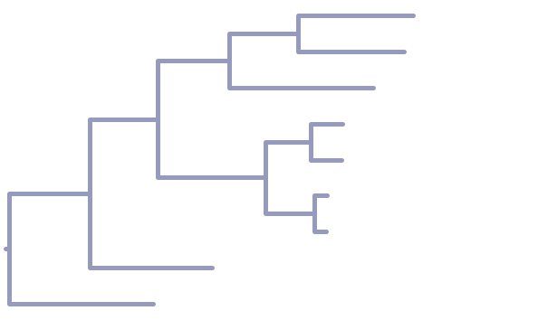
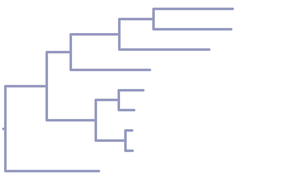
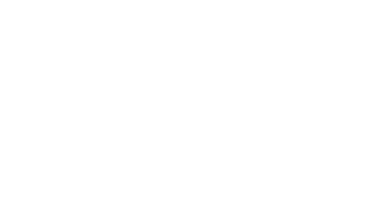

# Reference Genome Tree

## Preprocessing of Sequence Files

1. **Copying of Query Genomes:**
    Genomes listed in Table 1 of the 'data_acquisition' markdown note were copied into two separate folders within the 'reference_genomes' directory:
    - 'refseq'
    - 'non-refseq'

2. **Merging Sequence Files:**
    The Genbank-formatted files from both 'refseq' and 'non-refseq' folders were into a single FASTA file. This was accomplished using the 'seqconverter' tool (v. 2.14.0) with the following command:
    ~~~bash
    seqconverter -I genbank -O fasta non-refseq/*.gb refseq/*.gb > reference_genomes.fasta
    ~~~
3. **Directory Structure:**
    The 'reference_genomes' directory is organized as follows:
    ~~~
    reference_genomes/
    ├── non-refseq
    │   ├── KX902238.1.gb
    │   └── MG590288.1.gb
    ├── reference_genomes.fasta
    └── refseq
        ├── NC_027947.1.gb
        ├── NC_031864.1.gb
        ├── NC_031865.1.gb
        ├── NC_031866.1.gb
        ├── NC_031869.1.gb
        ├── NC_036613.1.gb
        └── NC_042502.1.gb
    ~~~

4. **Assesment of Sequence Quality:**
    The number of 'N's in the reference sequences and whether they are linear or circular is listed in the table below:
    |Species                 |Query Genome|# of 'N's* |Shape   |
    |------------------------|------------|-----------|--------|
    |Ectopistes migratorius  |NC_042502.1 |20 (0.12%) |linear  |
    |Goura cristata          |NC_031865.1 |0          |circular|
    |Goura scheepmakeri      |NC_027947.1 |0          |circular|
    |Goura sclaterii         |MG590288.1  |0          |circular|
    |Goura victoria          |NC_036613.1 |0          |circular|
    |Caloenas nicobarica     |NC_031869.1 |0          |circular|
    |Pezophaps solitaria     |KX902238.1  |261 (1.57%)|linear  |
    |Raphus cucullatus       |NC_031864.1 |0          |circular|
    |Didunculus strigirostris|NC_031866.1 |1 (0.01%)  |circular|
    *Percentages are rounded to the nearest hundredth.

## Alignment of Mitochondrial Genomes Using MAFFT

The mitochondrial sequences were aligned using MAFFT (v. 7.490), option 'auto', with the following command:
~~~bash
mafft --auto raw/reference_genomes/reference_genomes.fasta > processed/reference_genomes_aligned.fasta
~~~

Manual inspection of the alignment revealed a highly repetitive sequence characterized by 'caatcaacgaatgacca.....' present at the end of the Goura reference genomes, most notably in the genome of Goura sclaterii (MG590288.1), leading to gaps of 1151-1250 bp at the end of the other five sequences in the alignment.

The sequence alignment was converted to NEXUS format using 'seqconverter' with the following command:

~~~bash
seqconverter -I fasta -O nexus processed/reference_genomes_aligned.fasta > processed/reference_genomes.nexus
~~~

## Maximum Parsimony Tree Using PAUP

A maximum parsimony tree was constructed using PAUP 4.0a (build 168) with the Ectopistes migratorius genome (NC_042502.1) as outgroup, and the optimality criterion set to 'parsimony' using the following commands in the PAUP command-line interface:

~~~
paup> execute processed/reference_genomes.nexus
paup> outgroup NC_042502
paup> set root=outgroup
paup> bandb
~~~

The best tree and its calculated statistics, as listed below, were printed using the following command:

~~~
paup> describetrees 1/plot=phylogram
~~~
~~~
Tree length = 8568
Consistency index (CI) = 0.7285
Homoplasy index (HI) = 0.2715
CI excluding uninformative characters = 0.6095
HI excluding uninformative characters = 0.3905
Retention index (RI) = 0.5823
Rescaled consistency index (RC) = 0.4242
~~~

The tree was saved as a nexus file:
~~~
savetrees file=processed/mitochondria_tree.nexus brlens=yes
~~~

The tree labels and color were modified in FigTree, resulting in the figure below:

## Maximum Parsimony Tree of Cytochrome C Oxidase Subunits

1. **Concatenating and Merging COX1,-2, and -3 of Reference Genomes:**
To align the concatenated cytochrome c oxidase subunits of each reference genome, we first created a custom Python script, '__concatenate_genes.py__', that finds and concatenates the sequences of specified genes from a GenBank file. This script was then used to write the concatenation of COX1, COX2, and COX3 of each reference genome to a single FASTA file using the following commands:
    ~~~bash
    output_file="data/raw/reference_genomes/cox_subunits/cox_subunits.fasta"
    > "$output_file" # Clear the output file if it exists

    for file in data/raw/reference_genomes/*.gb; do
        echo ">$(basename ${file%.gb})" >> $output_file
        python3 src/preprocessing/concatenate_genes.py --genes COX1 COX2 COX3 --input $file >> $output_file
    done
    ~~~

2. **Alignment of COX Subunits using MAFFT:**
    The COX subunits were aligned with MAFFT using the following command:
    ~~~bash
    mafft --auto data/raw/reference_genomes/cox_subunits/cox_subunits.fasta > data/processed/cox_subunits.aligned.fasta
    ~~~

    The alignment was manually inspected with jalview (v. 2.11.2.7).
    The alignment was then converted to NEXUS format using 'seqconverter'.
    ~~~bash
    seqconverter -I fasta -O nexus data/processed/cox_subunits.aligned.fasta > data/processed/cox_subunits.nexus
    ~~~

3. **Maximum Parsimony Tree using PAUP:**
    We created a maximum parsimony tree of the reference genome COX subunits in PAUP, using Ectopistes migratorius as the outgroup, with the following commands:
    ~~~
    paup> execute data/processed/cox_subunits.nexus
    paup> outgroup NC_042502.1
    paup> set root=outgroup
    paup> bandb
    ~~~
    The shortest tree and its parsimony statistics were printed with 'describetrees':
    ~~~
    paup> describetrees 1/plot=phylogram
    ~~~
    ~~~
    Tree length = 1369
    Consistency index (CI) = 0.7195
    Homoplasy index (HI) = 0.2805
    CI excluding uninformative characters = 0.5954
    HI excluding uninformative characters = 0.4046
    Retention index (RI) = 0.5550
    Rescaled consistency index (RC) = 0.3994
    ~~~
    The tree was saved in NEXUS format:
    ~~~
    paup> savetrees file=processed/cox_subunits.tree.nexus brlens=yes
    ~~~

    We added species names to the leaf nodes and colored the tree in FigTree, resulting in the tree below.

## Comparative Analysis of Phylogenetic Trees

In our comparative analysis of the full mitochondrial tree and the COX subunits tree, we observed a notable differences in the placement of Didunculus strigirostris. Key observations and interpretations are as follows:

- **Position of Didunculus strigirostris:**
  In the COX subunits tree, Didunculus strigirostris appears to be more closely related to the Caloenas-Raphus-Pezophaps clade than the Goura clade is. Conversely, in the full mitochondria tree, Didunculus strigirostris is positioned outside the other clades of the ingroup.

- **Interpretation of Phylogenetic Differences:**
  This disparity in the phylogenetic placement of Didunculus strigirostris between the two trees could be attributed to the limited phylogenetic resolution provided by the COX subunits alone. It seems that the COX subunits may not be as effective in distinguishing between closely related species within the Columbidae family as the full mitochondrial sequences. Although, both trees correctly distinquishes the Goura species as in Bruxaux et al. (2017), where we also note that the too are unable to resolve the ingroup clades. [^1]

- **Consistency and Homoplasy Indices:**
  Interestingly, both the consistency index (CI) and the homoplasy index (HI) show remarkable similarity between the two trees, with differences of only 1/100th. This suggests that despite the different phylogenetic placements observed, the overall reliability and character-state distribution, as measured by these indices, are comparable between the two trees.

These observations underscore the importance of using comprehensive genomic data for phylogenetic studies, especially when dealing with closely related species. The choice of molecular markers can significantly influence the phylogenetic relationships inferred, highlighting the need for careful marker selection in phylogenetic analyses.

## Maximum parsimony tree using cytochrome b

1. **Extraction of cytochrome b DNA sequences:**
    Cytochrome b DNA sequences from the reference genomes were written to the FASTA file, '__cytochrome_b.fasta__', with the python executable '__concatenate_genes.py__' using the terms 'CYTB' and 'cob' for input genes as the gene is annotated by either name in the genbank files:
    ~~~bash
    output_file="/home/laniel/projects/pigeon_conservation/data/raw/referene_genomes/genes/cytb.fasta"
    > $output_file

    for file in data/raw/reference_genomes/*.gb; do
        echo ">$(basename ${file%.gb})" >> $output_file
        python3 src/preprocessing/concatenate_genes.py --genes CYTB cob --input $file >> $output_file
    done 
    ~~~

    The resulting FASTA file was manually assesed, and it was confirmed that each entry corresponded to the intended gene. 
    

2. **Alignment using MAFFT:**
    The cytochrome b sequences were aligned with mafft using the following commands:

    ~~~bash
    mafft --auto data/raw/reference_genomes/genes/cytb.fasta > data/processed/cytb.aligned.fasta
    ~~~

    We manually assesed the alignment with Jalview v. 2.11.2.7, noting that cytochrome b of Pezophaps solitaria (KX902238.1) has a 48 bp contiguous sequence of 'N's. The alignment was converted to NEXUS format with seqconverter ussing the following command:

    ~~~bash
    seqconverter -I fasta -O nexus data/processed/cytb.aligned.fasta > data/processed/cytb.nexus
    ~~~

3. **Maximum parsimony tree with PAUP:**
    We created a maximum parsimony tree with Ecopistes migratorius (NC_042502.1) as outgroup using PAUP with the following commands:

    ~~~bash
    paup> execute data/processed/cytb.nexus
    paup> outgroup NC_042502.1
    paup> set root=outgroup
    paup> bandb
    ~~~

    The shortest tree and its parsimony statistics were printed with 'describetrees':

    ~~~bash
    paup> describetrees 1/plot=phylogram
    ~~~

    ~~~bash
    Tree length = 540
    Consistency index (CI) = 0.7148
    Homoplasy index (HI) = 0.2852
    CI excluding uninformative characters = 0.5915
    HI excluding uninformative characters = 0.4085
    Retention index (RI) = 0.5686
    Rescaled consistency index (RC) = 0.4065
    ~~~

    And saved with branch lengths to data/processed/cytb.tree.nexus:

    ~~~bash
    paup> savetrees file=data/processed/cytb.tree.nexus brlens=yes
    ~~~
    
    We exchanged the accession numbers at the leaf nodes with the species names manually. The resulting tree is displayed below.

We noted that the Cytochrome B phylogram delineates the Goura species in the same way as the phylograms that were based on either the full mitochondrial genome or the Cytochrome C subunits. We also note that it disagrees with the two other trees on the delineation of Caloenas and Didunculus with respect to Raphus and Pezophaps.

[^1]:["Recovering the evolutionary history of crowned pigeons (Columbidae: Goura): Implications for the biogeography and conservation of New Guinean lowland birds"](https://www-sciencedirect-com.proxy.findit.cvt.dk/science/article/pii/S1055790317308679)