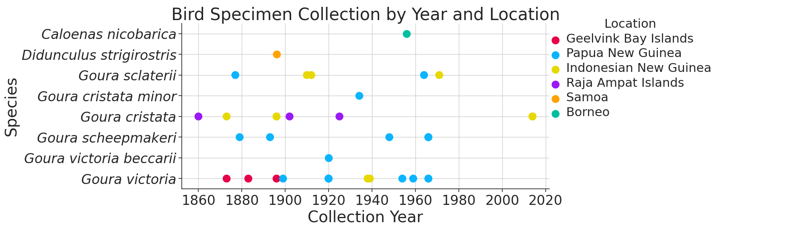

# Origins of Mitochondrial Genomes

## Overview

This document details the process and findings related to the origins of the biological samples used in our bioinformatic analysis. It includes details on the extraction of source qualifiers from GenBank files of MtDNA samples, observations from the data, and contextual historical information relevant to the samples.

## Extraction of Source Qualifiers from MtDNA GenBank Files
We utilized the script ['extract_qualifers.py'](../../src/preprocessing/extract_qualifiers.py) to extract relevant sample information from each GenBank file. The targeted data included 'organism', 'country', 'collection_date', 'collected_by', and 'specimen_voucher'. The extraction was executed with the following command and saved to ['sample_origins.csv'](../../data/metadata/sample_origins.csv):

~~~bash
python3 src/preprocessing/extract_qualifiers.py --directory data/raw --annotations organism --qualifiers country collection_date collected_by specimen_voucher > data/metadata/sample_origins.csv
~~~

## Scope of Extracted Metadata

Post-extraction, the data was organized in Excel. Key findings include:

- Collection dates were available for 34 Goura specimens (all four species), one Didunculus strigirostris, and one Caloenas nicobarica.
- Geographic origins of the samples, where recorded, were as follows:
    - 22 from Indonesia
    - 18 from Papua New Guinea
    - 1 (Didunculus strigirostris) from Samoa

## Sampling Location & Dates by Species

### Sample Locations of Species Through Time

To visualize the geographical and temporal extent of the collected specimen we plotted them according to collection date and species. This was done with the jupyter notebook [metadata_plot.ipynb](../../src/analysis/metadata_plot.ipynb).
This resulted in the following plot:

The four Goura locations were marked on a map of New Guinea and Raja Ampat, shown below, with the jupyter notebook [new_guinea_raja_ampat.ipynb](../../src/analysis/new_guinea_raja_ampat.ipynb):

### Interpretation of Geographical Distribution Pattern

The distinct geographical distributions of the four Goura species, as described by [^1] using much of the data as we, is also reflected in our data which shows a distribution of *Goura sclaterii* confined to mainland New Guinea; *Goura cristata* distributed in the Indonesian side of New Guinea and on the Raja Ampat Islands; *Goura scheepmakeri* confined to the Papua New Guinean side of New Guinea; and Goura victoria distributed across both halfs of mainland New Guinea and the Geelvink Bay Islands.

In addition to current geographical distributions, the historical context of the sequenced specimens is noteworthy. The sequence data used in this study, comprising all mitochondrial genomes of Goura species fullfilling our quality criteria, accessed November 2023, includes as the most recent Goura specimens from Papua New Guinea, the Raja Ampat Islands, the Geelvink Bay Islands, ones collected in 1966, 1925 and 1896 respectively. Data from the Global Biodiversity Information Facility (GBIF) indicate that the latest recorded sighting of a *Goura victoria* on one of the Geelvink Bay Islands to 1994 ([GBIF: *Goura victoria*](https://www.gbif.org/occurrence/2843598506)), while the most recent sighting of a *Goura cristata* on the Raja Ampat Islands was in 2023 ([GBIF: *Goura cristata*](https://www.gbif.org/occurrence/4130233618)). This suggests that, despite the absence of recent DNA sequences, crown pigeons were present on the Geelvink Bay Islands at least until 1994 and continue to exist on the Raja Ampat Islands. Therefore, it may be feasible to collect DNA from crown pigeons in these locations to facilitate a comprehensive genetic analysis of their population structure.

## Historical Context of the First Goura Specimen

The first Goura specimen - a *Goura cristata* - was, as specified in the GenBank file of the MtDNA genome, collected by Charles Martin Allen, assistant to Alfred Russel Wallace, during an 1860 expedition to Misool Island, Indonesia. This prompted a review of the literature, specifically *In Alfred Russel Wallace's Shadow: His Forgotten Assistant, Charles Allen (1839-1892)* by Kees Rookmaaker and John van Wyhe, for further insights.

### Excerpts from Wallace's Correspondences and Notebooks
In their paper, Rookmaaker and van Wyhe cite several colorful descriptions from Wallace's letters and notebooks of his and Allen's experiences. Wallace's initial character assessment of Allen, who was brought along as field assistant at only 16 years of age, is mentioned in a letter to his own mother, from July 1854 when camping in the jungle near Malacca, Malaysia:

>So far both I and Charles have enjoyed excellent health. He can now shoot
pretty well, and is so fond of it that I can hardly get him to do anything else.
He will soon be very useful, if I can cure him of his incorrigible carelessness.
At present I cannot trust him to do the smallest thing without watching that
he does it properly, so that I might generally as well do it myself.

Wallace growing reliance on Allen (Charley or Charles) is exemplified by a paragraph from one of Wallace's notebooks. Here he recalls, when one afternoon at Simunjan, Borneo Allen allerted him of an orangutan (a mias) sighted nearby:

>One afternoon I had just come home from an Entomologizing excursion &
was preparing for a bathe when Charley rushed in, out of breath with
running & excitement & exclaimed by jerks. ‘Get the gun sir—be quick—
such a large mias—oh!’—‘Where’ said I, ‘Close by’—he can’t get away.’ So
the gun was got out & one barrel being ready loaded with ball I started off
calling upon two Dyaks who happened to be in the house at the time to
accompany me & ordering Charles to bring all the ammunition after me as
quick as possible.

The vast contribution that Allen made to specimen collection is made clear by Rookmaaker's and van Wyhe's recounting that he in a two-and-a-half month period between 4 August and 18 October 1855 collected 6198 insects, corresponding to more then a hundred individuals per day, only a year after arriving in the Malay Archipelago.[^2]

[^1]: Bruxaux, Jade et al. (2018), ["Recovering the evolutionary history of crowned pigeons (Columbidae: Goura): Implications for the biogeography and conservation of New Guinean lowland birds"](https://www.sciencedirect.com/science/article/abs/pii/S1055790317308679) *Molecular Phylogenetics and Evolution*, 2018: vol. 120, pp. 248-258.

[^2]: Rookmaaker, Kees & van Wyhe, John. (2012), ["In Alfred Russel Wallace's Shadow: His Forgotten Assistant, Charles Allen (1839-1892)"](https://www.jstor.org/stable/24894190) *Journal of the Malaysian Branch of the Royal Asiatic Society*, 2012: vol. 85, Issue 2, pp. 17-54

