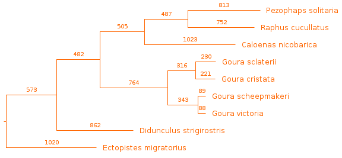
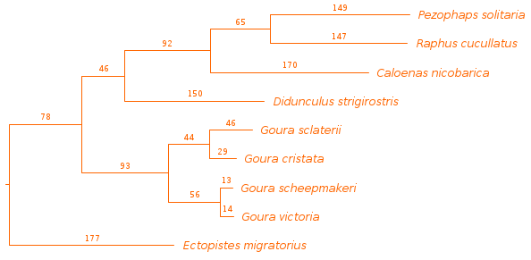
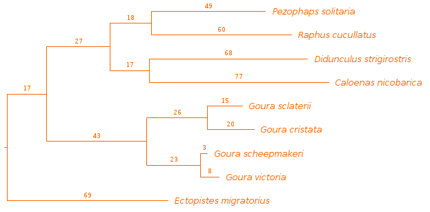

# Species Tree

## Overview of Tree Reconstruction
To infer the phylogenetic relationships between the nine species included in the study, we first made a maximum parsimony tree based on the full mitogenomes of the reference genomes. We then inferred maximum parsimony trees from the cytochrome c oxidase subunits or from cytochrome b to determine if either can be used to infer the phylogenetic relationships as well as the full mitogenome. The accession nrs. of the reference genomes are restated in the table below:

|Species                 |Query Genome|
|------------------------|------------|
|Ectopistes migratorius  |NC_042502.1 |
|Goura cristata          |NC_031865.1 |
|Goura scheepmakeri      |NC_027947.1 |
|Goura sclaterii         |MG590288.1  |
|Goura victoria          |NC_036613.1 |
|Caloenas nicobarica     |NC_031869.1 |
|Pezophaps solitaria     |KX902238.1  |
|Raphus cucullatus       |NC_031864.1 |
|Didunculus strigirostris|NC_031866.1 |

## Preprocessing of Sequence Files

1. **Copying of Query Genomes:**
    The reference genomes were copied into two separate folders within '__data/raw/reference_genomes__':
    - 'refseq'
    - 'non-refseq'

2. **Merging Sequence Files:**
    The mitogenomes of the Genbank-formatted files from both 'refseq' and 'non-refseq' folders were merged into a single FASTA file, each entry a mitogenome of one of the nine species. This was accomplished using the 'seqconverter' tool (v. 2.14.0) with the following command:
    ~~~bash
    seqconverter -I genbank -O fasta non-refseq/*.gb refseq/*.gb > reference_genomes.fasta
    ~~~
3. **Directory Structure:**
    The 'reference_genomes' directory was by then organized as follows:
    ~~~
    reference_genomes/
    ├── non-refseq
    │   ├── KX902238.1.gb
    │   └── MG590288.1.gb
    ├── reference_genomes.fasta
    └── refseq
        ├── NC_027947.1.gb
        ├── NC_031864.1.gb
        ├── NC_031865.1.gb
        ├── NC_031866.1.gb
        ├── NC_031869.1.gb
        ├── NC_036613.1.gb
        └── NC_042502.1.gb
    ~~~

4. **Assesment of Sequence Quality:**
    The number of 'N's in the reference sequences and whether they are linear or circular is listed in the table below:
    |Species                 |Query Genome|# of 'N's* |Shape   |
    |------------------------|------------|-----------|--------|
    |Ectopistes migratorius  |NC_042502.1 |20 (0.12%) |linear  |
    |Goura cristata          |NC_031865.1 |0          |circular|
    |Goura scheepmakeri      |NC_027947.1 |0          |circular|
    |Goura sclaterii         |MG590288.1  |0          |circular|
    |Goura victoria          |NC_036613.1 |0          |circular|
    |Caloenas nicobarica     |NC_031869.1 |0          |circular|
    |Pezophaps solitaria     |KX902238.1  |261 (1.57%)|linear  |
    |Raphus cucullatus       |NC_031864.1 |0          |circular|
    |Didunculus strigirostris|NC_031866.1 |1 (0.01%)  |circular|
    *Percentages are rounded to the nearest hundredth.

## Alignment of Mitochondrial Genomes Using MAFFT

The mitochondrial sequences were aligned using MAFFT (v. 7.490), option 'auto', with the following command:
~~~bash
mafft --auto raw/reference_genomes/reference_genomes.fasta > processed/reference_genomes_aligned.fasta
~~~

Manual inspection of the alignment revealed a highly repetitive sequence characterized by repeats of 'caatcaacgaatgacca.....' present at the end of the Goura reference genomes. Most notably in the genome of Goura sclaterii (MG590288.1) which led to gaps of 1151-1250 bp at the ends of the five non-Goura sequences in the alignment.

The sequence alignment was converted to NEXUS format, for use in PAUP, using 'seqconverter' with the following command:

~~~bash
seqconverter -I fasta -O nexus processed/reference_genomes_aligned.fasta > processed/reference_genomes.nexus
~~~

## Maximum Parsimony Tree Using PAUP

A maximum parsimony tree was constructed using PAUP 4.0a (build 168) with the optimality criterion 'parsimony', the Ectopistes migratorius genome (NC_042502.1) as outgroup, and a 'branch and bound' (bandb) search, using the following commands in the PAUP command-line interface:

~~~
paup> execute processed/reference_genomes.nexus
paup> outgroup NC_042502
paup> set root=outgroup
paup> bandb
~~~

The best tree and its calculated statistics, as listed below, were printed to the screen with 'describetrees':

~~~
paup> describetrees 1/plot=phylogram
~~~
~~~
Tree length = 8568
Consistency index (CI) = 0.7285
Homoplasy index (HI) = 0.2715
CI excluding uninformative characters = 0.6095
HI excluding uninformative characters = 0.3905
Retention index (RI) = 0.5823
Rescaled consistency index (RC) = 0.4242
~~~

The tree was saved as a nexus file:
~~~
savetrees file=processed/mitochondria_tree.nexus brlens=yes
~~~

The tree labels and color were modified in FigTree (v1.4.4), resulting in the mitogenome tree shown below, with number of nucleotide changes along each branch:

<!--Increase DPI and make bottem left branch red like the rest of the tree-->

## Maximum Parsimony Tree of Cytochrome C Oxidase Subunits

1. **Concatenating and Merging COX1,-2, and -3 of Reference Genomes:**
To align the concatenated cytochrome c oxidase subunits of each reference genome, we first created a custom Python script, ['concatenate_genes.py'](../../src/preprocessing/concatenate_genes.py), that finds and concatenates the sequences of specified genes from a GenBank file. This script was then used to write the concatenation of COX1, COX2, and COX3 of each reference genome to a single FASTA file using the following commands:
    ~~~bash
    output_file="data/raw/reference_genomes/genes/cox_subunits/cox_subunits.fasta"
    > "$output_file" # Clear the output file if it exists

    for file in data/raw/reference_genomes/*.gb; do
        echo ">$(basename ${file%.gb})" >> $output_file # Add basename of reference genome file to sequence name-line
        python3 src/preprocessing/concatenate_genes.py --genes COX1 COX2 COX3 --input $file >> $output_file # Use python script to fetch and concatenate COX subunits for reference genome and add to output file
    done
    ~~~
    resulting in the file [cox_subunits.fasta](../../data/raw/reference_genomes/genes/cox_subunits.fasta)

2. **Alignment of COX Subunits using MAFFT:**
    The reference genomes COX subunits were aligned with MAFFT using the following command:
    ~~~bash
    mafft --auto data/raw/reference_genomes/cox_subunits/cox_subunits.fasta > data/processed/cox_subunits.aligned.fasta
    ~~~

    The alignment was manually inspected with jalview (v. 2.11.2.7).
    The alignment was then converted to NEXUS format using 'seqconverter'.
    ~~~bash
    seqconverter -I fasta -O nexus data/processed/cox_subunits.aligned.fasta > data/processed/cox_subunits.nexus
    ~~~

3. **Maximum Parsimony Tree using PAUP:**
    We created a maximum parsimony tree of the reference genome COX subunits in PAUP, using Ectopistes migratorius as the outgroup, with the following commands:
    ~~~
    paup> execute data/processed/cox_subunits.nexus
    paup> outgroup NC_042502.1
    paup> set root=outgroup
    paup> bandb
    ~~~
    The shortest tree and its parsimony statistics were printed with 'describetrees':
    ~~~
    paup> describetrees 1/plot=phylogram
    ~~~
    ~~~
    Tree length = 1369
    Consistency index (CI) = 0.7195
    Homoplasy index (HI) = 0.2805
    CI excluding uninformative characters = 0.5954
    HI excluding uninformative characters = 0.4046
    Retention index (RI) = 0.5550
    Rescaled consistency index (RC) = 0.3994
    ~~~
    The tree was saved in NEXUS format:
    ~~~
    paup> savetrees file=processed/cox_subunits.tree.nexus brlens=yes
    ~~~

    We added species names to the leaf nodes and colored the tree in FigTree (v1.4.4), resulting in the tree below.

## Comparative Analysis of Phylogenetic Trees

In our comparative analysis of the full mitochondrial tree and the COX subunits tree, we observed a notable difference in the placement of Didunculus strigirostris. Key observations and interpretations are as follows:

- **Position of Didunculus strigirostris:**
  In the COX subunits tree, Didunculus strigirostris appears to be more closely related to the Caloenas-Raphus-Pezophaps clade than the Goura clade is. Conversely, in the full mitochondria tree, Didunculus strigirostris is positioned outside the other clades of the ingroup.

- **Interpretation of Phylogenetic Differences:**
  This disparity in the phylogenetic placement of Didunculus strigirostris between the two trees could be attributed to the limited phylogenetic resolution provided by the COX subunits alone. It seems that the COX subunits may not be as effective in distinguishing between closely related species within the Columbidae family as the full mitochondrial sequences. Both trees correctly dileneate the Goura species as in Bruxaux et al. (2017), placing Goura victoria and Goura scheepmakeri together, and Goura cristata and Goura sclaterii together.[^1]

- **Comparison of Homoplasy Indices:**
  To find the most parsimonious of the two trees we compared the homoplasy indeces (HI) which is a measure of the frequency of independently evolved shared traits in the tree. A lower homoplasy index indicates a more parsimonious tree with fewer such instances. With an HI of 0.2715, 0.009 lower than the COX subunit tree's, the full mitochondria tree provides a more direct interpretation of the species' evolutionary history. 

These observations underscore the importance of using comprehensive genomic data for phylogenetic studies, especially when dealing with closely related species. The choice of molecular markers can significantly influence the phylogenetic relationships inferred, highlighting the need for careful marker selection in phylogenetic analyses. The full mitochondrial tree agrees in its placement of Didunculus with the Maximum Likelihood phylogeny by Soares et al. [^2]

## Maximum Parsimony Tree of Cytochrome B
To asses the phylogenetic signal of Cytochrome B, we also made a maximum parsimony tree from this gene for the nine reference genomes using the same aproach as for the two previous trees.

1. **Extraction of Cytochrome B DNA Sequences:**
    Cytochrome B DNA sequences from the reference genomes were written to the FASTA file, '__cytochrome_b.fasta__', with the python executable ['concatenate_genes.py'](../../src/preprocessing/concatenate_genes.py) using the terms 'CYTB' and 'cob' for input genes as Cytochrome B is annotated by either name in the genbank files:
    ~~~bash
    output_file="/home/laniel/projects/pigeon_conservation/data/raw/referene_genomes/genes/cytb.fasta"
    > $output_file

    for file in data/raw/reference_genomes/*.gb; do
        echo ">$(basename ${file%.gb})" >> $output_file
        python3 src/preprocessing/concatenate_genes.py --genes CYTB cob --input $file >> $output_file
    done 
    ~~~

    The resulting FASTA file was manually assesed, and it was confirmed that each entry corresponded to the intended gene from the genbank files. 
    

2. **Alignment using MAFFT:**
    The Cytochrome B sequences were aligned with MAFFT using the following command:

    ~~~bash
    mafft --auto data/raw/reference_genomes/genes/cytb.fasta > data/processed/cytb.aligned.fasta
    ~~~

    We manually assesed the alignment with Jalview (v. 2.11.2.7), noting that Cytochrome B of Pezophaps solitaria (KX902238.1) has a 48 bp contiguous sequence of 'N's. The alignment was converted to NEXUS format with seqconverter using the following command:

    ~~~bash
    seqconverter -I fasta -O nexus data/processed/cytb.aligned.fasta > data/processed/cytb.nexus
    ~~~

3. **Maximum Parsimony Tree with PAUP:**
    We created a maximum parsimony tree using the 'branch and bound' algorithm (bandb) as previously. We again set Ectopistes migratorius (NC_042502.1) as the outgroup. The process was executed in PAUP with the following commands:

    ~~~
    paup> execute data/processed/cytb.nexus
    paup> outgroup NC_042502.1
    paup> set root=outgroup
    paup> bandb
    ~~~

    The shortest tree and its parsimony statistics were printed with 'describetrees':

    ~~~bash
    paup> describetrees 1/plot=phylogram
    ~~~

    ~~~bash
    Tree length = 540
    Consistency index (CI) = 0.7148
    Homoplasy index (HI) = 0.2852
    CI excluding uninformative characters = 0.5915
    HI excluding uninformative characters = 0.4085
    Retention index (RI) = 0.5686
    Rescaled consistency index (RC) = 0.4065
    ~~~

    And saved with branch lengths to '__data/processed/cytb.tree.nexus__':

    ~~~
    paup> savetrees file=data/processed/cytb.tree.nexus brlens=yes
    ~~~
    
    We exchanged the accession numbers at the leaf nodes with the species names manually using FigTree (v1.4.4). The resulting tree is displayed below.

Comparing the Cytochrome B tree with the two others, we note that it disagrees in the placement of Didunculus strigirostris by placing it as a sister species to Caloenas nicobarica. We also note that the Cytochrome B tree is the least parsimonious tree, with the highest HI at 0.285 (compared to 0.2805 for the COX subunits tree and 0.2715 for the full mitochondrial tree). And, we note that all three trees dileneate the Goura species in the same way.

Return to [README](../../README.md).

[^1]: Bruxaux, Jade et al. (2018), ["Recovering the evolutionary history of crowned pigeons (Columbidae: Goura): Implications for the biogeography and conservation of New Guinean lowland birds"](https://www.sciencedirect.com/science/article/abs/pii/S1055790317308679) *Molecular Phylogenetics and Evolution*, 2018: vol. 120, pp. 248-258.

[^2]: Soares, André E. R. et al. (2016), ["Complete mitochondrial genomes of living and extinct pigeons revise the timing of the columbiform radiation"](https://bmcecolevol.biomedcentral.com/articles/10.1186/s12862-016-0800-3) *BMC Evolutionary Biology*, 2016: vol. 16, article nr. 230.
